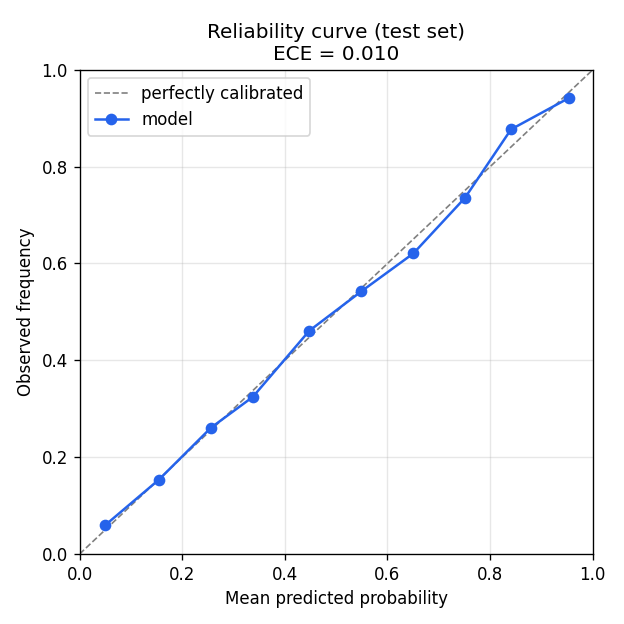
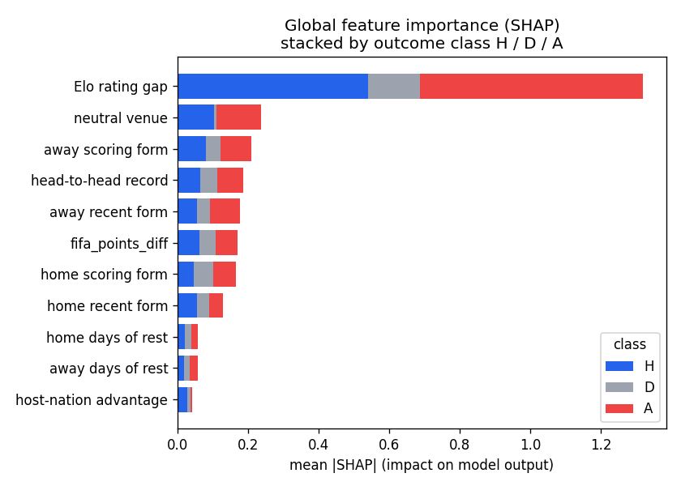

# ⚽ Glass-Box World Cup 2026 Predictor

**Calibrated match predictions you can see *inside* — every probability comes with its SHAP
explanation, then a Monte Carlo simulation rolls them up to title odds for the 48-team 2026 World Cup.**

### 🔗 [**Live demo → glass-box-world-cup-predictor.streamlit.app**](https://glass-box-world-cup-predictor.streamlit.app/)

[](https://glass-box-world-cup-predictor.streamlit.app/)
[](https://github.com/SBoxho/glass-box_World_Cup_predictor/actions/workflows/ci.yml)
[](https://www.python.org/)
[](LICENSE)

> 📸 _Tip: drop a screenshot/GIF of the live app here — for a portfolio repo the visual is the single highest-value element above the fold._

The differentiator is **transparency, not just accuracy**: a glass box, not a black box. Most
football predictors hand you a number. This one shows you *why* — the Elo gap, recent form,
venue, and head-to-head behind every prediction — and is honest about the fact that, against a
strong Elo baseline, the machine-learning lift is small. The value is **calibration**,
**explainability**, and **simulation**.

| Reliability (test set) | Global feature importance |
| --- | --- |
|  |  |

The probabilities are genuinely usable as probabilities — expected calibration error **≈ 0.007**.

---

## ✨ What it does

- **Match Predictor** — pick two teams + a venue, get calibrated win/draw/loss probabilities, a
  SHAP contribution chart, and an auto-generated plain-English read
  (*"The model leans England: + neutral venue, + scoring form; tempered by head-to-head record."*).
- **Tournament Simulator** — Monte Carlo over the full 48-team bracket (12 groups → top 2 + 8
  best thirds → Round of 32 → Final) to each team's probability of reaching every stage and
  lifting the trophy, plus the most-likely final.
- **Under the Hood** — global SHAP summary, the calibration curve, and an honest temporal
  backtest against baselines, with a methodology + limitations write-up.

---

## 🏗️ Architecture

```
glassbox-worldcup/
├── core/                      # UI-agnostic engine — ALL logic lives here, zero Streamlit imports
│   ├── config.py              # paths, constants, the canonical feature list, team-name aliases
│   ├── ingest.py              # download + clean results.csv; load/validate the 2026 draw
│   ├── elo.py                 # rolling Elo from full match history (date-batched, leak-free)
│   ├── features.py            # POINT-IN-TIME feature engineering + fast inference state
│   ├── model.py               # train / calibrate / persist / predict (+ neutral symmetry)
│   ├── explain.py             # SHAP wrappers: global summary + per-match + narrative
│   └── simulate.py            # Monte Carlo tournament (48-team / Round-of-32 format)
├── scripts/
│   ├── build_dataset.py       # ingest -> features -> data/processed/
│   └── train.py               # features -> models/model.joblib + metrics + plots
├── app/streamlit_app.py       # thin presentation layer — imports from core/
├── api/main.py                # OPTIONAL FastAPI stub (decoupled-architecture demo, un-deployed)
├── data/wc2026.json           # the real Dec-2025 draw: 12 groups, hosts, R32 bracket (committed)
├── models/model.joblib        # trained + calibrated artifact (committed, ~2 MB)
└── tests/                     # the three guardrail tests (below)
```

**The architectural rule:** `app/` and `api/` may import from `core/`, **never the reverse**.
`core/` has no UI framework imports. That one-directional dependency is what keeps the model
layer reusable (the same engine powers the Streamlit app and the FastAPI stub) and is the main
signal of production-quality structure here.

---

## 🔬 How it works

1. **Data** — every men's international since 1872 from the public
   [`martj42/international_results`](https://github.com/martj42/international_results) mirror
   (no API key). Team names are normalized to one canonical spelling so the dataset, the draw,
   and Elo all join cleanly. See [`DATA_SOURCES.md`](DATA_SOURCES.md).
2. **Elo** — chess-style ratings replayed over full history; the K-factor scales with goal
   margin and tournament importance (friendly < qualifier < World Cup), and home advantage lives
   in the *expectation* and is zeroed at neutral venues.
3. **Point-in-time features (no leakage)** — Elo gap, recent form & goal difference, decayed
   head-to-head, venue, host advantage, days of rest — each computed using **only matches
   strictly before** the match date.
4. **Calibrated XGBoost** — a multiclass {H, D, A} model, isotonic-calibrated via cross-validation
   so the outputs are real probabilities, not just argmax labels. Neutral-venue predictions are
   symmetrized so `predict(A, B)` mirrors `predict(B, A)`.
5. **SHAP** — `TreeExplainer` gives per-match contributions (and the plain-English narrative) plus
   a global importance view.
6. **Monte Carlo** — group outcomes sampled from the calibrated probabilities; Poisson scorelines
   drive the tiebreakers; knockout draws resolve by relative strength (an extra-time/penalties proxy).

---

## 📊 Honest results

Strict **temporal** backtest (no random folds): trained on 2002 → mid-2023, tested on the most
recent **3,357** completed internationals (2023-06-15 → 2026-06-14).

| Model | Log-loss ↓ | Accuracy ↑ | ECE ↓ |
| --- | --- | --- | --- |
| **Calibrated XGBoost** | **0.8714** | 0.605 | **0.0069** |
| Baseline: Elo-only (logistic) | 0.8647 | 0.606 | — |
| Baseline: always-home | 1.0526 | 0.474 | — |

**The honest takeaway:** in international football, Elo is a *very* strong baseline. The ML model
essentially **matches** it on accuracy and log-loss — it does **not** meaningfully beat it. What
the model adds is excellent **calibration** (ECE ≈ 0.007 — the reliability curve hugs the
diagonal), per-prediction **explainability**, and a tournament **simulation** layer. Reporting a
small/null accuracy gain transparently is the point: a glass box tells you what it can and can't do.

### Sanity check — simulated 2026 title odds

The simulator's favorites are plausible and its most-likely final (**Argentina vs Spain**) matches
the real-world storyline from the draw — the two top seeds were placed on opposite halves and can
only meet in the final.

| Team | Champion |
| --- | --- |
| Spain | ~35% |
| Argentina | ~14% |
| Germany / Brazil / England | ~7–9% each |

(Exact numbers depend on the seed and simulation count.)

### Limitations

International football is a **small-data, high-variance** sport: upsets are common and a single
tournament is one noisy draw from these distributions. Squad changes, injuries, and form swings
are only partially captured by Elo and rolling form. The Round-of-32 third-place slotting
**approximates** FIFA's exact combination table (the qualification logic — top 2 + 8 best thirds —
is exact). **This is an educational / decision-support tool — probabilistic, not betting advice.**

---

## ✅ Guardrail tests

Three properties that are easy to get subtly wrong are pinned with hermetic tests (synthetic data,
no network, no committed artifacts needed):

- **`test_features_no_leakage.py`** — features recomputed from a strictly-before-date history must
  exactly match the pipeline's output (and the strict-before boundary must actually bite).
- **`test_symmetry.py`** — neutral-venue predictions are mirror-symmetric, while a real home
  advantage is *not* silently symmetrized away.
- **`test_simulate_format.py`** — 48 teams enter, exactly 32 reach the R32 (24 + 8 best thirds),
  the best-third ranking is correct, no team meets its own group in the R32, and there is exactly
  one champion.

```bash
pytest          # all three, plus aggregation checks
```

---

## 🚀 Reproduce locally

Requires Python 3.11+ (developed on 3.13).

```bash
pip install -r requirements.txt
python scripts/build_dataset.py     # download + clean history, engineer features (~30 s)
python scripts/train.py             # train, calibrate, write models/ artifacts (~30 s)
streamlit run app/streamlit_app.py  # launch the app
```

The repo ships with a trained `models/model.joblib`, so you can skip straight to
`streamlit run ...` from a clean clone — the app downloads the match history it needs on first launch.

Optional API stub: `uvicorn api.main:app --reload` → `GET /predict?home=Brazil&away=France&neutral=true`.

---

## 🌐 Deployment

**Live on Streamlit Community Cloud:**
[glass-box-world-cup-predictor.streamlit.app](https://glass-box-world-cup-predictor.streamlit.app/)
— it builds from the pinned `requirements.txt` and auto-redeploys on every push to `main`.

To deploy your own fork: push to GitHub, then on [share.streamlit.io](https://share.streamlit.io)
connect the repo with entrypoint `app/streamlit_app.py`. The committed `models/model.joblib` lets
it boot without training; the app downloads the match history it needs on first launch.

**Hugging Face Spaces (Streamlit SDK)** — a free second mirror. Create a Space and add this YAML
header to the very top of the `README.md` you push there:

```yaml
---
title: Glass-Box World Cup 2026 Predictor
emoji: ⚽
colorFrom: blue
colorTo: indigo
sdk: streamlit
sdk_version: 1.58.0
app_file: app/streamlit_app.py
pinned: false
---
```

---

## 🛠️ Tech stack

Python 3.11 · pandas · numpy · scikit-learn · XGBoost · SHAP · Streamlit · Plotly · pytest · ruff.
CI (lint + tests) runs on every push via GitHub Actions.

## 📄 License

MIT — see [LICENSE](LICENSE). Match data © its respective sources; see
[`DATA_SOURCES.md`](DATA_SOURCES.md).
